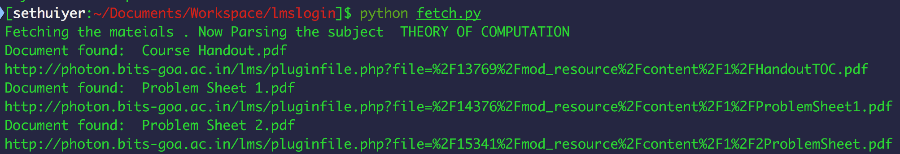
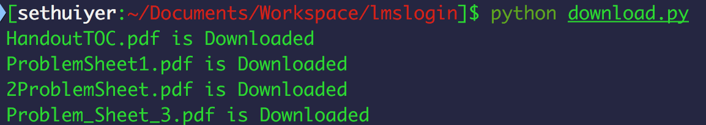

# LMS-Downloader

A python script which downloads all the materials of registered courses from BITS-LMS.

## Usage

First open `credentials/lms.yml` file and write your username and password of the BITS-LMS.

Then execute `fetch.py` to fetch your registered course and it's material links. Make sure you have Robobrowser installed in your python package. It can be installed as `easy_install robobrowser` or `pip install robobrowser`.

Then run `python download.py` and wait for the script to finish. 

Please raise issues and pull requests in case of any feature request or issues.

